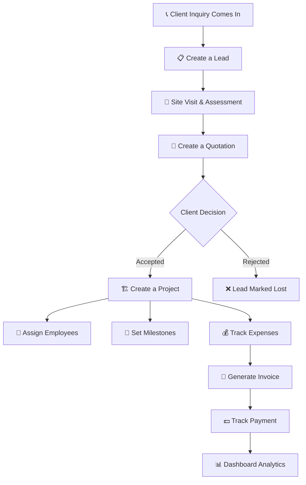

# Construction CRM — Full Project Walkthrough

## What Is This Project?

This is an **internal business management system for a construction company**. Think of it as a complete digital office — from the moment a potential client calls you, all the way through to sending them the final invoice after the project is done.

It's a **single-company tool** (not a SaaS platform). One construction company installs it, and their staff (owner, managers, accountants, field employees) all log in and use it together.

---

## The Real-World Workflow This App Digitizes

Here's how a construction company actually operates, and how each step maps to a feature in the app:



### Step-by-Step:

| Step | Real World | In The App |
|---|---|---|
| **1. Client calls** | Someone asks about building a house or commercial project | Staff creates a **Lead** with client name, phone, source (referral, walk-in, website) |
| **2. Follow up** | Sales person contacts client, schedules site visit | Lead status moves: `New → Contacted → Site Visit` |
| **3. Give a quote** | Estimate materials, labor, create a price document | Create a **Quotation** with line items (cement ×100 bags, labor ×30 days, etc.) → auto-calculates totals |
| **4. Client says yes** | Agreement signed, work begins | Quotation marked `Accepted` → **Project** created automatically from the lead |
| **5. Work starts** | Hire workers, buy materials, manage timeline | **Employees** assigned to project, **Milestones** set (foundation, framing, roofing, finishing) |
| **6. Money goes out** | Buying materials, paying labor, transport costs | **Expenses** logged per project (with receipt uploads), categorized (materials, labor, transport) |
| **7. Bill the client** | Send invoice for completed milestone or full project | **Invoice** generated from project data, sent as PDF, payment tracked |
| **8. Get paid** | Client pays in installments or full | Invoice status: `Sent → Partially Paid → Paid` |
| **9. Business overview** | Owner wants to know: how's the business doing? | **Dashboard** shows: active leads, projects, revenue, expenses, overdue invoices |

---

## What's Built vs. What's Remaining

### ✅ Already Built (Phases 1–9)

```
Phase 1 — Foundation & Auth          ██████████ DONE
Phase 2 — Lead Management            ██████████ DONE  
Phase 3 — Quotations                 ██████████ DONE
Phase 4 — Projects                   ██████████ DONE
Phase 5 — Employees                  ██████████ DONE
Phase 6 — Expenses                   ██████████ DONE
Phase 7 — Invoices                   ██████████ DONE
Phase 8 — Document Uploads           ██████████ DONE
Phase 9 — Dashboard & Analytics      ██████████ DONE
```

**What you can do right now:**
- 🔐 Owner registers → invites team members (admin, manager, employee, accountant)
- 📋 Create leads, track them through a pipeline (Kanban board + table view)
- 📝 Create quotations from leads with line items and auto-calculated totals
- 🏗️ Convert accepted quotations to projects, define milestones, and assign employees
- 👷 Manage employees and job roles (salaries only visible to owner/admin/accountant)
- 💰 Submit, approve, or reject expense claims per project
- 🧾 Generate invoices, PDFs, email-ready invoice records, and overdue reminders
- 📁 Upload and preview documents through local or Cloudflare R2 storage
- 📊 View role-aware dashboard analytics for pipeline, projects, invoices, and expenses
- 🛡️ Role-based access control across all modules

---

### 🔜 Still Needs To Be Built (Phases 10–13)

```
Phase 10 — Polish                    ░░░░░░░░░░ TODO ← NEXT
Phase 11 — Testing                   ░░░░░░░░░░ TODO
Phase 12 — Deployment                ░░░░░░░░░░ TODO
Phase 13 — Portfolio Packaging       ░░░░░░░░░░ TODO
```

---

## Phase-by-Phase: What Each One Delivers

### Phase 4 — Projects 🏗️

> **"A client said yes — now manage the actual construction work"**

- Convert an accepted quotation into a **Project**
- Track project status: `Planning → In Progress → On Hold → Completed → Cancelled`
- Set **milestones** with due dates (Foundation, Structure, Electrical, Finishing)
- See **budget vs. actual spending** at a glance
- Assign employees to specific projects

### Phase 5 — Employees 👷

> **"Manage your workforce"**

- Employee directory (name, phone, CNIC, role, salary)
- Salary info only visible to Owner / Admin / Accountant (not managers or employees)
- Upload employee documents (CNIC copy, contract)
- See which projects each employee has worked on

### Phase 6 — Expenses 💰

> **"Track every rupee going out"**

- Log expenses by category: Materials, Labor, Transport, Overhead, Other
- Link expenses to a specific project or mark as general/overhead
- Upload receipt photos
- **Approval workflow**: Employee submits → Manager/Accountant reviews → Approved/Rejected

### Phase 7 — Invoices 🧾

> **"Bill the client professionally"**

- Generate invoices from project data (pull in quotation line items and approved expenses)
- **PDF generation** with branded layout and browser preview/download
- Track payment status: `Draft → Sent → Partially Paid → Paid → Overdue`
- **Automatic overdue detection** with persisted reminder count and timestamps
- Email invoices directly to clients

### Phase 8 — Document Uploads 📁

> **"All files in one place"**

- Upload and attach files to any entity (lead, project, employee, invoice)
- Files stored through a document storage abstraction with **Cloudflare R2-compatible** presigned uploads and a local-dev fallback
- Preview PDFs and images directly in the browser
- File type and size validation

### Phase 9 — Dashboard & Analytics 📊

> **"How's the business doing at a glance?"**

- **Active leads count** & pipeline value
- **Active projects** with progress
- **Monthly revenue** trend chart
- **Overdue invoices** alert
- **Expense breakdown** by category (pie chart)
- **Lead conversion funnel** (how many leads become projects?)
- **Role-aware views**:
  - Owner/Admin → sees everything
  - Manager → operations focus (leads, projects)
  - Accountant → financial focus (expenses, invoices, revenue)
  - Employee → only sees their assigned projects

### Phase 10 — Polish ✨

> **"Make it feel production-ready"**

- **Global search** across leads, projects, invoices
- **In-app notifications** (new lead assigned, expense approved, invoice overdue)
- **Audit log viewer** — who did what and when
- Loading skeletons, empty states, error boundaries
- Mobile-responsive design

### Phase 11 — Testing 🧪

> **"Make sure nothing breaks"**

- Unit tests for every backend service
- Component tests for the frontend
- End-to-end Playwright test: Login → Create Lead → Quote → Project → Invoice

### Phase 12 — Deployment 🚀

> **"Put it live on the internet"**

- **Frontend** deployed to Vercel (free hosting)
- **API + Database** deployed to Railway
- **CI/CD** via GitHub Actions — push code → auto-deploy
- Health check endpoints, environment variables configured

### Phase 13 — Portfolio Packaging 🎁

> **"Show it off on Fiverr / freelance profiles"**

- 2–3 min Loom demo video
- Fiverr gig description targeting construction business owners
- Live demo site with a nightly-reset demo account
- GitHub repo with README, architecture diagram, and screenshots

---

## The 5 User Roles & What They Can Do

| | Owner | Admin | Manager | Accountant | Employee |
|---|:---:|:---:|:---:|:---:|:---:|
| **Manage users** | ✅ | ✅ | ❌ | ❌ | ❌ |
| **Leads** | Full | Full | Full | ❌ | View assigned |
| **Quotations** | Full | Full | Full | View only | ❌ |
| **Projects** | Full | Full | Full | View only | View assigned |
| **Employees/Salary** | Full | Full | View (no salary) | Full | ❌ |
| **Expenses** | Full | Full | Submit | Approve all | Submit own |
| **Invoices** | Full | Full | View only | Full | ❌ |
| **Dashboard** | Everything | Everything | Operations | Financials | Own projects |

---

## What the Finished Website Looks Like

When all 13 phases are complete, the construction company owner gets:

### A Modern Dashboard
> Revenue trends, active projects, overdue invoices, expense breakdown — all at a glance with interactive charts

### Full Lead-to-Invoice Pipeline
> `Client calls → Lead created → Quote sent → Project starts → Expenses tracked → Invoice sent → Payment received`
> 
> Every step tracked, nothing falls through the cracks

### Professional PDF Documents
> Quotations and invoices generated as branded PDFs with company letterhead — ready to email or print

### Role-Based Team Access
> Owner sees everything. Accountant sees finances. Manager handles operations. Employees see only their work. Nobody steps on each other's toes.

### Cloud Document Storage
> Receipts, contracts, CNIC copies, project photos — all uploaded and attached to the right record

### Automated Reminders
> Overdue invoices trigger email reminders automatically — no more manually chasing payments

---

## Tech Architecture (Simple View)

```
┌─────────────────┐         ┌──────────────────┐         ┌──────────────┐
│   React SPA     │◄──REST──►│   Express API    │◄──SQL──►│  PostgreSQL  │
│   (Vite)        │         │   (TypeScript)   │         │  (Supabase)  │
│   Port: 5173    │         │   Port: 4000     │         │              │
└─────────────────┘         └────────┬─────────┘         └──────────────┘
                                     │
                            ┌────────┴────────┐
                            │  Cloudflare R2  │ ← file storage
                            │  Resend Email   │ ← notifications
                            └─────────────────┘
```

---

## Summary

> [!IMPORTANT]
> **In a nutshell**: This is a full-stack construction business management CRM. We've built the core lead-to-invoice workflow, including auth, leads, quotations, projects, employees, expenses, invoices, document uploads, and dashboard analytics. Next we polish the operator experience, then expand testing, deployment, and portfolio packaging.
>
> **Progress: ~69% complete** (9 of 13 delivery phases done). The core business workflow is now established — next up is production-readiness polish.
